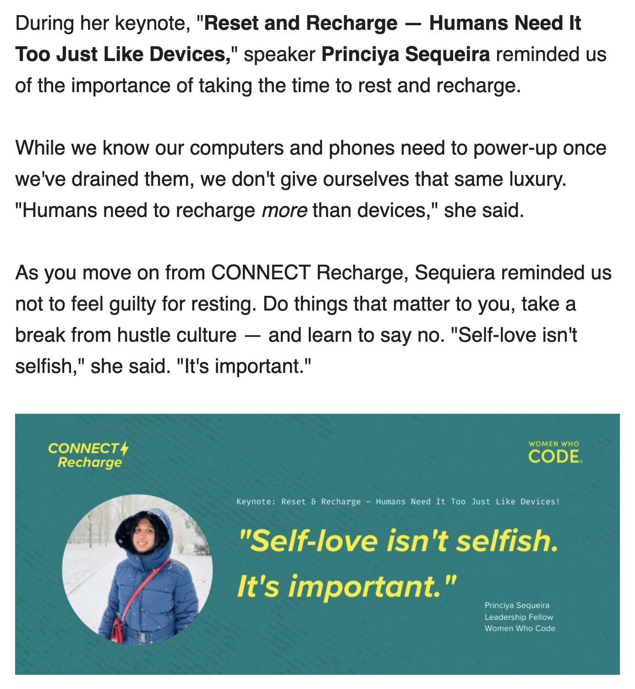

Title: How I spent my holiday
Date: 2022-05-27
Category: Journal
Tags: random

It is a 4-day long weekend. Yesterday, 26th May was a German public holiday, and today is a snake day holiday from Anaconda.

I spent the entire day yesterday preparing for my [keynote talk at WWCode Connect 2022](../reset-recharge), which was very well received. There was a lot of positive feedback and appreciation. Personally, I am very happy with this talk.

## Snake days at Anaconda

At Anaconda, we have a snake day holiday every month. In Germany, in addition to the 30 day annual leave, we also get snake day holidays. So we have 30 + 12 days of annual leave at Anaconda.

We are hiring at Anaconda, do check open roles or contact me if you are interested.

## What did I do today

I woke up late and got to my desk only an hour ago. At the time of writing this post, it is 17:04 CET.

I have been browsing random things, looking at some home office furniture to buy.

I watched a little bit of Bling Empire on Netflix earlier today. Riverdale, Bridgerton are on my list. I cannot believe Riverdale has a new season 6!

I have been following up on social media from yesterday's keynote comments and feedback.

The [following](https://mailchi.mp/066157bf02bb/connect-forward-is-1-month-away-872086) was sent on today's WWCode newsletter, and I have been cross-posting this on my social media.

## 9 months at Anaconda

When I have long weekends, I also sit and think about my career. Today was analysing how are things for me at Anaconda. I have been with Anaconda for 9 months now and things are really good, I am happy about my progress overall and the kind of problems I get to solve on a daily basis. There is so much learning happening everyday and so much work getting done.

Everyday I look forward to growing in my career, one step at a time.

## My reading list

I read a few articles from Leaddev today.

I am now reading few system design articles from ByteByteGo.

I was following updates from InvactMetaversity, looks like the drama has been resolved today.

## Will I have my own startup

I often think to myself, if I were to build something what would that be? I still have not found any answer.

I do occassionally come up with ideas and think they could be the next big thing. The following were the ones where I came close to get them executed, but did not. Obviously, had I done, it would have already been the next big thing :D. 

- Portal to connect midwives and new moms
- Automatic blog generator based on the content read or written for that week

## Grow in my career

While I am not sure about a startup, I am definitely aiming to grow in my career and I do believe I am in the right track!

> Director > VP > CTO

