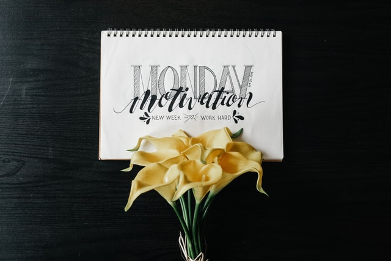

Title: How do I prepare for a Monday
Date: 2022-05-23
Category: Leadership
Tags: time management
Cover: images/monday.jpg

It is Monday!

I usally need a lot of warm up time on Monday mornings and get productive on Mondays only towards the second half of the day.

## Monday's yak shaving on Friday

In order to have a productive Monday, I make sure I have a prioritised list ready on my desk on Friday evening. This is something I started practising recently, and has been working very well for me.

During the weekend, I make sure I don't do any work related things and start work directly on Monday morning. The prioritised list helps me with relevant context to start the Monday.

## Analog notes taking

My note taking method is analog. I jot down notes on pen and paper. My biggest satisfaction over the week is crossing off the todos from my list and tossing the paper into the dustbin. This feels like such a big relief from a mental load point of view.

## How does it help me

I was wondering if the analog way would help me be productive. In this digital age, should I too not make a digital move? How will I access the information from everywhere?

I have a good memory, but when dealing with multipel things and constant context switching and interruption driven development, it is only natural that I cannot track each and every thing.

With my analog notes taking, I make it a point to visit my notes every now and then. I write my important todos in a different paper, while writing the random things as they pop up in another paper. This can be multiple papers for a given day based on the workload. When I revisit my notes every now and then, the frequency I am talking about is atleast twice a week, it helps me refresh my memory.

I then start writing them over again in a new paper and recategorise and reprioritise. Writing over again and revisiting does help me stay on top of things, and there is very little chance to miss out or forget things.

## Isn't digital better

With digital ways, it does help me track notes from outside, when I am not on my work desk. But I have little motivation to revisit my digital todos over and over again and hence things sit idle or unvisited for a long time. During this time, my memory is replaced with other things and I forget.

There might be better digital ways, offcourse I am not debating on that.

But my choice is analog notes taking, highlight with colors, revisit and get things done.

I am very productive, and I can totally recommed this way of doing incase you are looking to find a productive way.

Happy Monday! :) 

