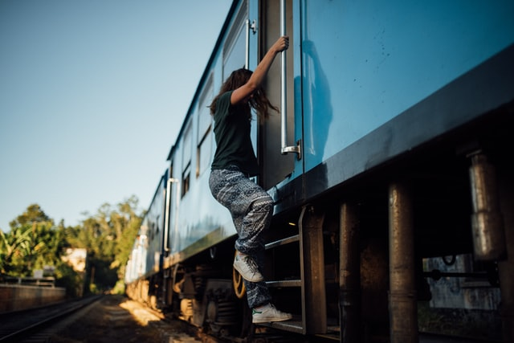

Title: My onboarding experience in a remote world
Date: 2022-05-24
Category: Leadership
Tags: onboarding, EM
Cover: images/onboard.jpg

I joined Anaconda in September 2021. During the pandemic, although I got used to working in a remote work setup, starting a new job in a remote first setup was difficult.

## The difference

During my time at Curalie, ~1 year was spent in pandemic and remote setup. Things were direct and it was a smooth transition, mostly because I knew the team, I knew the product, I knew the company.

At Anaconda, I didn’t know my team, I didn’t know the product, I didn’t know the company.

Onboarding was not only about getting the job done, but it also involved dealing with the online fatigue, and timezone differences.

I wished to see people and interact with them in real life!

## What did I do

We do have a good 30-6-90 day RAMP plan and I used this as an opportunity to understand my primary priorities.

My top priority was getting the EM’s job done.

Since I was new at the company, I also used the time to interact with colleagues on slack, participate in initiatives that were not directly related to my team and get to know other teams and people too.

## Ask questions

Apart from the remote-first setup, joining Anaconda to me was coming to a Python world from Javascript. Most of the things obvious to folks was not obvious to me. I had to step back often and learn so many new things.

> I kept asking questions.

I tried to phrase answers and be courageous to talk about them so that I could be corrected and learn from the process.

I drew diagrams to help visualise things better and learn things faster.

## What can be improved

I have great empathy for new hires across Anaconda. For the ones in my team, I let them know that the onboarding process can be overwhelming, and we try to improve this experience one step at a time for the folks joining next. <3

_Photo by Etienne Boulanger https://unsplash.com/photos/LHtFRAsNWSc_

