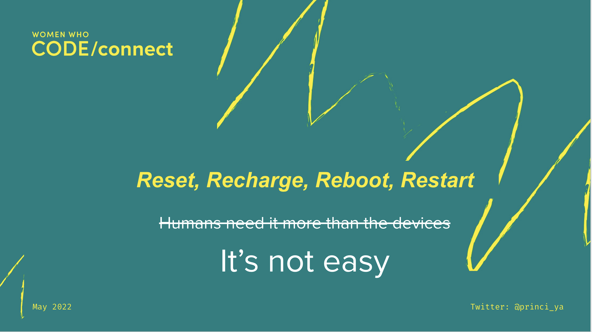

Title: Reset and Recharge - my first keynote
Date: 2022-05-26
Category: Talks
Tags: career, story, advice, wwcode
Cover: images/reset.png

[Slides - Reset and Recharge](https://docs.google.com/presentation/d/1KiK9KJGHodYgOnMZZs371uKo8FYsw1abgFkH11Tz1a8/edit#slide=id.gf8d3ef5cb9_2_0)

When the phone battery drains, what do we do? When the laptop gets heated up, what do we do? We are forced to shut it down, or buy a replacement in the worst case. In this era, the blinking red battery icons on our smartphones, tablets and laptops send us all scrambling for our chargers.

## What do we do

Similarly, when work drains our battery by the middle of the week, what do we do? When the workload increases and our brain can no longer process things, what do we do? Take a moment to realise what do you actually do?
We all have our own reasons to be doing what we have done or what we do,
But, how many times have you ignored the blinking red battery icon on yourself, and pushed yourself hard? If yes, why? What would you have done alternately?

## Break the stereotypes

In this age of “Just do it” and “Yes we can” , refusal has come to be seen as something negative. “No” is what tired, worn-out people say. “No, stop that” is what sleep-deprived parents tell their energetic children. We need to stop these stereotypes!

> Reset, recharge, reboot, restart - humans need it more than the devices!

## Reset from the hustle culture

In this world of social media, it is easy to get tempted to do what others are doing. I am not asking here you all to stop being ambitious but rather to focus on your energy in doing things that truly matter to you.
We don't have to read books or pick up hobbies just because others are doing it.

## Do things that matter to you

We can still have a good weekend by being lazy or just binge-watching. What is important is to be able to take frequent pauses from the busy life, reset oneself, and be recharged!

## Volunteering and time management

As a Leadership Fellow at WWCode, I talk to a lot of folks who are interested in volunteering. They are usually excited about the opportunity, and for many, this is their first time volunteering gig. But one of the biggest problems is that many fail to balance their time and end up not coming back to their volunteering commitments.
I try to tell them that they do not have to be guilty if they fail to find time for their volunteering commitments. I ask them to take up tasks that have the maximum benefit for them and not take upon tasks that they are forced to do.

From my observation, people want to be volunteers sometimes mostly by seeing others doing it, i.e. hustle culture. These are the ones who usually never come back when they realize that this is not meant for them. And that’s fine.

> One important learning here is to be selfish, identify what is important for yourself.

## Learn to say No

Time management is a common topic during my discussions with the community. The only difference was that some knew and acknowledged they were in a time crisis, but others were shy or hesitated to admit this.
As you start your career or the next step for yourself in life, this is one of the things you will have to unlearn and learn. Unlearn from saying yes to everything, Learn to say NO and learn to prioritise the important.

Few questions to ask before saying yes!
What purpose does this serve? Be selfish here, identify what does really matter to you
Let’s say you said yes, it is still not late to say no. What is stealing my energy or motivation? How do I refuel?

## Does life get boring

I was once asked by an intern if life as a software developer ever get boring after years of work?
I asked them how did it feel like to be an intern?

- Were you bored?
- Was it challenging?
- Were the days exciting?
- Did you think of giving up?

I then asked them to  reflect on the thing they did prior to their internship and if there were any similarities.
Life as a software developer too goes through these phases, most of the time!

- Boring
- Challenging
- Exciting
- Give up

## My first failure

Failures will come along the way; you may not get your desired promotion or it might take a lot of time until you land your first job.
When I graduated in 2009, almost a dozen years ago, there was a global recession and things didn’t go as planned for me. I cried a lot the day after my first failed job interview. Being good at academics and extra curriculars, this was the first biggest failure for me.

I was hopeful that I would make it to the next company but this kept happening couple more times and I had no clue about what was going wrong. I gave up after a few attempts.

## I gave up

I felt like I needed a break after studying all those years so hard and not being able to find my dream job.

That year, in 2009, I took up a teaching job and for the next two years I worked as a Lecturer in Computer Science at an engineering college. 

> Unknowingly, I got a recharge in my life. 

I was happy, some of my colleagues were my best friends, we are still good friends.

Looking back at it, If I were to advice my younger self, then I would say that everything happens for good.

If you aren’t being rejected more than accepted, you’re not asking for enough, reaching high enough and valuing yourself enough. Try new things, do things you are scared of.

I quit this teaching job after 2 years, and in 2011 I joined as a full time software engineer.

## No risk, no story!

During the initial years as a Software Engineer, I worked at a startup, so I had the opportunity to do full-stack, understand BE systems, dev ops, databases, UI design, etc. If I can recollect, it's this learning environment that I had that led me to learn and grow in my career. 
Sometimes I had to do photoshop, sometimes Java, or sometimes think about why our system was down and running slowly. I was also taking basic lessons on machine learning.

I was working at a startup, and a lot of people including my parents were asking me to leave this company and join a bigger firm. But I stuck to it mainly because I realized how much I had to learn. As they say,

> No risk, no story!

This is the career path I wanted, I chose it for myself and I have worked hard for this. Most important: I am very happy today and I continue to love what I do.

## Reset and recharge - what can we learn from computer science

WWCode Connect is Dedicated to inspiring you to achieve your career advancement goals, recharge your connections, and continue building your skills!

In the world of computer science, where algorithms, design patterns and data structures are considered fundamental, what if we were to reframe our thinking around these concepts. 

## Design Patterns

Is there a design pattern towards shaping our career?
Design patterns are typical solutions to commonly occurring problems in software design. 
Each one of our life is unique given the circumstances that we live in. We can have role models to follow, but in the end often we will realise there is no pattern to copy paste a career based on someone else.
Like a design pattern, the exact order of implementation is up to us to shape our career.

## Algorithms

An algorithm defines a clear set of actions that can achieve some goal.
What if we had an algorithm to learn?
Like an algorithm and its implementation, each one of our learning efficiency can vary. We can find ourselves to be caught up in a time or a space constraint.
If your plan does not work, change the plan, change the algorithm, tweak it. have a plan B!  Have a goal in your life, always! Avoid changing the goal itself! But tweak your learning algorithm to be efficient to achieve your learning goal.

## Data Structures

A data structure is a collection of data values, the relationships among them, and the functions or operations that can be applied to the data.
Our habits are like data structures.

It’s the tiny habits that you will cultivate along the way that will help you shape your career into a successful one. Be honest, trustworthy and be true to yourself and your job.

Don’t be guilty if you decide to binge watch Netflix or just get a good sleep and enjoy being lazyful over the weekends. Take breaks, drink water, workout, focus on your health. Health is wealth. Nothing is easy and you need to keep learning and working hard all the time.

> Work hard, but smart!

## Breadth vs Depth

I often get asked this question about how to learn.
While there are loads of tools, technologies and frameworks out there, it is natural to get overwhelmed. How to learn new things at this rate?To know something in depth it takes time, and this is where experience counts. 

If you are early on in your career or beginning your career I advice folks to try out various topics before deciding what to focus in depth. Go breadth first before depth.

## Be curious, ask questions

Be curious, ask questions and learn new topics. Think like a child, who is curiously exploring various topics. It is very important to have mentors at this stage who will guide you and show you directions to explore more.

Like a child who should first learn to crawl before learning to walk, during early years it is also important to focus on the core fundamentals which will serve to be the basis as you advance.

Once you are past the early years phase, it is a good time to focus on niche areas or deep dive into the topics that you were passionate about during your breadth first exploration phase.
Now is a good time to indentify if you want to focus on frontend, backend, fullstack, etc. Learn more about the subject, do more of it, practice more of it to get better.

## Life is a full stack circle

When you feel you are comfortable on a specific topic, move onto the next one and continue this loop. A child learns to crawl, walk, run, talk. These are the basics. 

These core skills are used every walk of life and as we advance we grow wiser. When you reach seniority in your career or subject then you need to pick up something new and start the cycle all over again. 
It is getting a Reset, this time not with default settings, but with customised settings based on where you are for the given time.

## It is not easy

If only reset was easy like in devices. Humans have emotions and that’s where it makes it complicated.

Exactly, a year ago I resigned from my previous job to join at Anaconda. Before Anaconda, I was working at Curalie. I had grown in this role into engineering leadership and I could not have been happier with my career path. But after 3 years, it was also the time for me to move on and look for bigger challenges.

Resigning from Curalie was not hard, but it turned out to be emotional, more than I expected. I resigned, submitted my papers and had a loud cry. It is during this time that I realised that I just had a job break up, a job that I enjoyed and had grown as a person and a leader.

> I had to grieve over it.

I decided to use the time to say goodbyes to colleagues and work on a good handover. And before joining Anaconda, I had a nice holiday.

## Conclusion

It is not easy. But we are humans, we need it more, we need it often.

It is important to:

- Unlearn from being harsh on yourself.
- Do not fear failures, learn your lessons and move on.
- Learn to stay happy and Look after your well-being.

Thank you women who code for this keynote opportunity.

